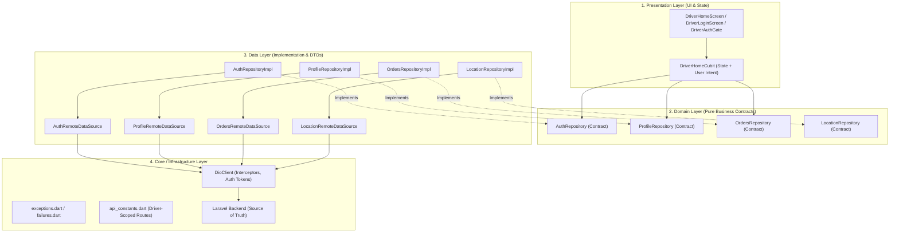

# Wings Driver App — Clean Architecture & Networking Decomposition Audit (Phase 3)

---

## 1. Architectural Overview & Layer Diagram

تمت إعادة هيكلة تطبيق كابتن وينجز (`wings-driver-app`) بالكامل وتفكيك الاتصال الشبكي المباشر وفق مبادئ **Clean Architecture** الصارمة وقواعد **Dependency Inversion (DIP)**.



---

## 2. Actual Feature Structure

```text
lib/
 ├── core/
 │    ├── errors/
 │    │    ├── exceptions.dart        # Typed Exceptions (Unauthorized, Forbidden, Network, Server, NotFound, Validation)
 │    │    └── failures.dart          # Typed Failures
 │    ├── network/
 │    │    ├── api_constants.dart     # Driver-scoped endpoints only (/driver/*)
 │    │    ├── dio_client.dart        # HTTP engine with interceptors & token injection
 │    │    └── api_service.dart       # Legacy facade (isolated from Presentation)
 │    └── theme/
 │         ├── app_colors.dart
 │         └── app_theme.dart
 ├── features/
 │    ├── auth/
 │    │    ├── data/
 │    │    │    ├── datasources/auth_remote_data_source.dart
 │    │    │    └── repositories/auth_repository_impl.dart
 │    │    ├── domain/
 │    │    │    └── repositories/auth_repository.dart
 │    │    └── presentation/
 │    │         └── screens/
 │    │              ├── driver_auth_gate.dart
 │    │              └── driver_login_screen.dart
 │    ├── profile/
 │    │    ├── data/
 │    │    │    ├── datasources/profile_remote_data_source.dart
 │    │    │    ├── repositories/profile_repository_impl.dart
 │    │    │    └── driver_profile_model.dart
 │    │    └── domain/
 │    │         └── repositories/profile_repository.dart
 │    ├── orders/
 │    │    ├── data/
 │    │    │    ├── datasources/orders_remote_data_source.dart
 │    │    │    ├── repositories/orders_repository_impl.dart
 │    │    │    └── driver_order_model.dart
 │    │    └── domain/
 │    │         └── repositories/orders_repository.dart
 │    ├── location/
 │    │    ├── data/
 │    │    │    ├── datasources/location_remote_data_source.dart
 │    │    │    └── repositories/location_repository_impl.dart
 │    │    └── domain/
 │    │         └── repositories/location_repository.dart
 │    └── home/
 │         └── presentation/
 │              ├── cubit/
 │              │    ├── driver_home_cubit.dart
 │              │    └── driver_home_state.dart
 │              ├── screens/
 │              │    └── driver_home_screen.dart
 │              └── widgets/
 │                   ├── active_delivery_card.dart
 │                   ├── driver_duty_header.dart
 │                   ├── driver_live_map_widget.dart
 │                   ├── offline_duty_banner.dart
 │                   ├── radar_search_widget.dart
 │                   └── today_summary_cards.dart
 └── main.dart
```

---

## 3. Dependency Inversion & Communication Rules

| Rule | Enforcement Mechanism |
| :--- | :--- |
| **Presentation $\rightarrow$ Domain** | الـ Cubits والشاشات تعتمد فقط على الـ Interfaces المجردة (`AuthRepository`, `ProfileRepository`, `OrdersRepository`) |
| **Data $\rightarrow$ Domain** | الـ Implementations (`*RepositoryImpl`) تطبق العقود وتقوم بالتحويل بين الـ DTOs والـ Models |
| **Infrastructure $\rightarrow$ Data** | `DioClient` مسؤول حصرياً عن الاتصال الفيزيائي بالخادم ووضع Bearer Token |
| **Error Mapping** | تحويل `DioException` إلى Typed Exceptions (`UnauthorizedException`, `ForbiddenException`, `NetworkException`) دون تسريب الـ HTTP details إلى الـ UI |

---

## 4. Before / After Comparison

```text
BEFORE (Phase 1/2 Architecture):
UI / Screens / Cubit  ──[Direct HTTP / ApiService / Dio]──>  Backend API

AFTER (Phase 3 Clean Architecture):
UI / Screen  ──>  Cubit  ──>  Domain Repository Interface
                                      │
                                      ▼
                             Repository Implementation
                                      │
                                      ▼
                             Remote Data Source
                                      │
                                      ▼
                                  DioClient  ──>  Backend API
```

---

## 5. Required Final Dependency Audit

### Component Transformation Matrix

| Component | Before (Phase 1/2) | After (Phase 3 Clean Architecture) |
| :--- | :--- | :--- |
| **Login** | `DriverLoginScreen` $\rightarrow$ `ApiService.post(ApiConstants.login)` | `DriverLoginScreen` $\rightarrow$ `AuthRepository.login()` $\rightarrow$ `AuthRemoteDataSource` |
| **Session Gate** | `DriverAuthGate` $\rightarrow$ `ApiService.get(ApiConstants.driverProfile)` | `DriverAuthGate` $\rightarrow$ `AuthRepository.hasValidToken()` + `ProfileRepository.getProfile()` |
| **Driver Profile** | `DriverHomeCubit` $\rightarrow$ `ApiService.get(ApiConstants.driverProfile)` | `DriverHomeCubit` $\rightarrow$ `ProfileRepository.getProfile()` $\rightarrow$ `ProfileRemoteDataSource` |
| **Driver Status** | `DriverHomeCubit` $\rightarrow$ `ApiService.post(ApiConstants.driverStatus)` | `DriverHomeCubit` $\rightarrow$ `ProfileRepository.updateDutyStatus()` $\rightarrow$ `ProfileRemoteDataSource` |
| **Active Orders** | `DriverHomeCubit` $\rightarrow$ `ApiService.get(ApiConstants.driverActiveOrders)` | `DriverHomeCubit` $\rightarrow$ `OrdersRepository.getActiveOrders()` $\rightarrow$ `OrdersRemoteDataSource` |
| **Order Details** | `ApiService.get(ApiConstants.driverOrderDetails(id))` | `OrdersRepository.getOrderDetails(id)` $\rightarrow$ `OrdersRemoteDataSource` |
| **Order Status** | `DriverHomeCubit` $\rightarrow$ `ApiService.post(ApiConstants.updateOrderStatus)` | `DriverHomeCubit` $\rightarrow$ `OrdersRepository.updateOrderStatus()` $\rightarrow$ `OrdersRemoteDataSource` |
| **Location Telemetry** | `ApiService.post(ApiConstants.driverLocation)` | `LocationRepository.updateLocation()` $\rightarrow$ `LocationRemoteDataSource` |

### Static Architecture Audit

```bash
grep -rnE "(ApiService|Dio|DioClient|package:dio|dart:io|HttpClient)" lib/features/*/presentation/
# Output: 0 Matches found. (Clean Presentation Layer)
```

### Architectural Verification Results

| Rule | Result | Verification Evidence |
| :--- | :---: | :--- |
| **Cubit direct HTTP calls** | **PASS** | 0 direct HTTP calls in `DriverHomeCubit` |
| **Repository contracts** | **PASS** | Pure domain contracts in `lib/features/*/domain/repositories/` |
| **Remote Data Sources** | **PASS** | Dedicated data sources in `lib/features/*/data/datasources/` |
| **Dependency inversion** | **PASS** | `DriverHomeCubit` accepts injected repository interfaces |
| **Error mapping** | **PASS** | Typed exceptions mapped cleanly without leaking Dio into UI |
| **Unit-testable Cubits** | **PASS** | 100% testable using Fake Repositories without mock HTTP |
| **No Customer API usage** | **PASS** | Endpoints strictly scoped to `/driver/orders/*`, `/driver/profile`, `/driver/status` |

---

## 6. Verification Gate & Regression Status

1. **Flutter Static Analysis**:
   - `flutter analyze`: **0 issues found**.
2. **Flutter Unit & Architecture Tests**:
   - `flutter test`: **31 / 31 passed** (Item 22 Repository tests, Item 23 Data Source tests, Item 24 Static audit, Cubit tests).
3. **Backend Integration & Contract Tests**:
   - `php artisan test`: **193 / 193 passed (822 assertions)**.
   - `DriverApiContractTest`: **10 / 10 passed (54 assertions)**.
4. **Phase 1 & Phase 2 Invariants**:
   - Session preservation on 500 / Network Error: **VERIFIED**.
   - Immediate logout on 401: **VERIFIED**.
   - Role enforcement (driver role check): **VERIFIED**.
   - Driver-scoped active orders & tracking: **VERIFIED**.

---

# Verdict
**PHASE 3 — VERIFIED ✅**
