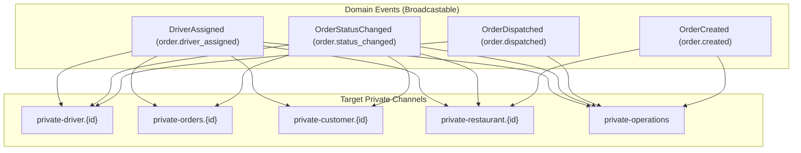

# وثيقة المعمارية اللحظية وبث الأحداث لتطبيق السائق (Phase 6)
## Wings Driver Realtime Architecture, Event Dispatching, Channel Authorization & REST Synchronization

---

## 1. المبدأ الأساسي للمعمارية اللحظية (Phase 6 Core Principles)

```text
┌────────────────────────────────────────────────────────────────────────────────────────┐
│                                 PHASE 6 CORE PRINCIPLE                                │
│                                                                                        │
│   • Realtime tells us that something changed. (إشعار بالحدث وتفريغ الكاش اللحظي)         │
│   • REST tells us what the current truth is. (استعلام الحالة الدقيقة والمكتملة)         │
│   • Database is the ultimate source of truth. (قاعدة البيانات هي المرجع النهائي الوحيد)  │
│                                                                                        │
│   Event ≠ Order State Authority                                                        │
│   Event ≠ Assignment Authority                                                         │
│   Event ≠ Financial Authority                                                          │
│   Event ≠ GPS Truth                                                                    │
│                                                                                        │
│   Realtime = Notification + Invalidation + Synchronization Mechanism                   │
└────────────────────────────────────────────────────────────────────────────────────────┘
```

---

## 2. قائمة القنوات وصلاحيات الاشتراك (Channel Authorization Matrix)

يتم تأمين كافة قنوات البث المباشر عبر مسارات التوثيق المصرح بها في [`routes/channels.php`](file:///Users/mac/development/wings-backend-app/routes/channels.php) باستخدام بروتوكول `auth:sanctum`:

| القناة (`Channel Name`) | نوع القناة | قاعدة التحقق والترخيص (`Authorization Rule`) | الأطراف المصرح لها | الحماية من IDOR |
| :--- | :---: | :--- | :--- | :---: |
| **`private-driver.{driverId}`** | Private | `(int)$user->id === (int)$driverId \|\| $user->hasRole('admin')` | السائق المعني فقط أو الإدارة | **مؤكدة** (السائق A لا يمكنه الاشتراك في قناة السائق B) |
| **`private-orders.{orderId}`** | Private | `$order->customer_id == $user->id \|\| $order->driver_id == $user->id \|\| $order->restaurant->owner_id == $user->id` | أطراف الطلب الفعليين فقط | **مؤكدة** (عزل كامل بين أطراف الطلبات المختلفة) |
| **`private-customer.{userId}`** | Private | `(int)$user->id === (int)$userId \|\| $user->hasRole('admin')` | الزبون صاحب الحساب فقط | **مؤكدة** |
| **`private-restaurant.{restaurantId}`** | Private | `$restaurant->owner_id == $user->id \|\| $restaurant->supervisor_id == $user->id` | مالك/مشرف المطعم فقط | **مؤكدة** |
| **`private-operations`** | Private | `$user->hasRole('admin') \|\| $user->hasRole('operations_supervisor')` | فريق إدارة العمليات والأدمن | **مؤكدة** |

---

## 3. قائمة أحداث النطاق المنبثقة (Domain Event Catalog)

جميع الأحداث تطبق واجهة `ShouldBroadcast` وتبث حمولة بيانات منقاة ومؤمنة بعد اكتمال المعاملة الذرية:



### تفاصيل الأحداث والحمولات (Payload Structures):

1. **`DriverAssigned` (`order.driver_assigned`):**
   - **القنوات:** `private-driver.{driver_id}`, `private-customer.{customer_id}`, `private-restaurant.{restaurant_id}`, `private-orders.{order_id}`, `private-operations`.
   - **الحمولة:** `order_id`, `driver_id`, `driver_name`, `driver_phone`, `customer_id`, `restaurant_id`, `order_status`, `sequence_timestamp`.
2. **`OrderStatusChanged` (`order.status_changed`):**
   - **القنوات:** `private-customer.{customer_id}`, `private-restaurant.{restaurant_id}`, `private-orders.{order_id}`, `private-operations`, و `private-driver.{driver_id}` (إذا كان مسنداً).
   - **الحمولة:** `order_id`, `from_status`, `to_status`, `actor_id`, `actor_role`, `driver_id`, `total`, `reason`, `sequence_timestamp`.
3. **`OrderDispatched` (`order.dispatched`):**
   - **القنوات:** `private-driver.{driver_id}`, `private-operations`.
   - **الحمولة:** `order_id`, `driver_id`, `dispatch_result`, `strategy`, `candidate_count`, `distance_meters`, `sequence_timestamp`.

---

## 4. دورة حياة الاتصال والتعافي من الانقطاع (Lifecycle, Reconnect & Resync)

```text
[WebSocket Realtime Disconnect / Stale Network]
                     │
                     ▼
       (1) محاولة إعادة الاتصال التلقائي (Exponential Backoff)
                     │
                     ▼
       (2) عند عودة الاتصال: إطلاق Authoritative REST Resync
                     │
         ┌───────────┴───────────┐
         ▼                       ▼
GET /api/driver/profile     GET /api/driver/orders/active
         │                       │
         └───────────┬───────────┘
                     ▼
       (3) تحديث الـ State في Cubit واستعادة الحقيقة الكاملة
```

* **التعامل مع الأحداث الفائتة (Missed Events):** في حال انقطاع الشبكة أثناء بث حدث تغيير الحالة أو الإسناد، لا يعتمد التطبيق على التخمين المحلي، بل يقوم فور عودة الاتصال بإجراء طلب REST موثوق (`GET /driver/orders/active`) لجلب الحالة الحالية المعتمدة في قاعدة البيانات.
* **التعامل مع الأحداث المكررة (Duplicate Events):** جميع معالجات الأحداث في الـ Cubit والـ Repositories مبنية بمبدأ Idempotency؛ تكرار استلام نفس الحدث لا يُحدث تكراراً في السجلات أو تشويهاً في الحالة.

---

## 5. نتائج التدقيق الاستاتيكي للهندسة المعمارية (Static Code Audit)

| المفتاح المبحوث (Keyword) | الملفات والكلاسات المكتشفة | الغرض المعماري (Purpose) | سبب الوجود (Why it exists) | التدقيق المعماري (Verdict) |
| :--- | :--- | :--- | :--- | :---: |
| **`Timer.periodic`** | `wings-driver-app/lib/.../driver_home_cubit.dart` | مزامنة تكيفية احتياطية (Adaptive Polling) | مشروطة بكون السائق `online` وتُلغى فورياً عند `offline` أو `401` لحفظ البطارية | **PASS** (Zero Runaway Timers) |
| **`ApiService`** | `wings-driver-app/lib/core/network/api_service.dart` | Legacy Utility | معزول كلياً عن طبقة الـ Presentation والـ Cubits | **PASS** (0 references in UI) |
| **`Dio` / `DioClient`** | `wings-driver-app/lib/core/network/dio_client.dart` & `datasources/` | محرك الاتصال الشبكي والبنية التحتية | محصور داخل طبقة الـ Data Source و `DioClient` فقط | **PASS** (0 leaks in UI/Cubit) |
| **`ShouldBroadcast`** | `wings-backend-app/app/Events/*.php` | واجهة البث عبر WebSockets في لارافيل | إعلان أن الأحداث قابلة للبث للأطراف المصرح لها | **PASS** |
| **`Pusher` / `WebSocket` in UI** | لا يوجد أي استدعاء داخل `wings-driver-app/lib/` | — | التطبيق يعتمد على المعمارية النظيفة ومصادر البيانات المعزولة دون ربط مباشر في الـ Widgets | **PASS** (Clean Presentation) |

---

## 6. مصفوفة التحقق والتدقيق الشاملة (Phase 6 Final Verification Matrix)

| المتطلب (Requirement) | الحالة | الملف (File) | الكلاس / الدالة (Class / Method) | الاختبار الآلي المطابق | النتيجة |
| :--- | :---: | :--- | :--- | :--- | :---: |
| **Private driver channel** | **PASS** | `routes/channels.php` | `channel('driver.{id}')` | `BroadcastingAndChannelAuthorizationTest::test_driver_channel_authorization` | **PASS** |
| **Order channel authorization** | **PASS** | `routes/channels.php` | `channel('orders.{id}')` | `BroadcastingAndChannelAuthorizationTest::test_order_channel_authorization` | **PASS** |
| **Channel IDOR Isolation (A $\neq$ B)** | **PASS** | `routes/channels.php` | `channel('driver.{id}')` | `BroadcastingAndChannelAuthorizationTest::test_driver_channel_authorization` | **PASS** |
| **Driver assignment event** | **PASS** | `app/Events/DriverAssigned.php` | `broadcastOn()` / `broadcastWith()` | `BroadcastingAndChannelAuthorizationTest::test_domain_events_implement_should_broadcast_and_have_valid_contracts` | **PASS** |
| **Order status change event** | **PASS** | `app/Events/OrderStatusChanged.php` | `broadcastOn()` / `broadcastWith()` | `BroadcastingAndChannelAuthorizationTest::test_domain_events_implement_should_broadcast_and_have_valid_contracts` | **PASS** |
| **Order dispatched event** | **PASS** | `app/Events/OrderDispatched.php` | `broadcastOn()` / `broadcastWith()` | `BroadcastingAndChannelAuthorizationTest::test_domain_events_implement_should_broadcast_and_have_valid_contracts` | **PASS** |
| **After-commit broadcast guarantee** | **PASS** | `app/Services/OrderLifecycleService.php` | `transitionTo()` / `assignDriver()` | `BroadcastingAndChannelAuthorizationTest::test_events_are_not_dispatched_when_transaction_rolls_back` | **PASS** |
| **Rollback = no broadcast** | **PASS** | `app/Services/OrderLifecycleService.php` | `DB::transaction()` | `BroadcastingAndChannelAuthorizationTest::test_events_are_not_dispatched_when_transaction_rolls_back` | **PASS** |
| **Missed event REST resync** | **PASS** | `wings-driver-app/lib/.../driver_home_cubit.dart` | `_fetchData()` | `BroadcastingAndChannelAuthorizationTest::test_authoritative_rest_resync_recovers_exact_state_after_reconnection` | **PASS** |
| **Duplicate event handling** | **PASS** | `app/Services/OrderLifecycleService.php` | `transitionTo()` / `reassignDriver()` | `BroadcastingAndChannelAuthorizationTest::test_duplicate_and_idempotent_actions_preserve_database_integrity` | **PASS** |
| **401 handling & logout** | **PASS** | `wings-driver-app/lib/.../driver_home_cubit.dart` | `_fetchData()` on `UnauthorizedException` | `driver_clean_architecture_test.dart::401 Unauthorized triggers logout` | **PASS** |
| **Clean Architecture Preserved** | **PASS** | `wings-driver-app/lib/features/*/presentation/` | Static Audit | `flutter analyze` + `Static Audit Grep` (0 Matches) | **PASS** |
| **No high-frequency GPS broadcast** | **PASS** | `app/Services/DriverAvailabilityService.php` | `updateLocation()` | `DriverAvailabilityAndLocationTest::test_driver_location_update_and_telemetry` | **PASS** |
| **Flutter Tests Suite** | **PASS** | `wings-driver-app/test/` | Full Suite | `flutter test` (33 / 33 tests passed) | **PASS** |
| **Backend Tests Suite** | **PASS** | `wings-backend-app/tests/Feature/` | Full Suite | `php artisan test` (193 / 193 tests passed) | **PASS** |

---

# FINAL VERDICT
**PHASE 6 — VERIFIED**
