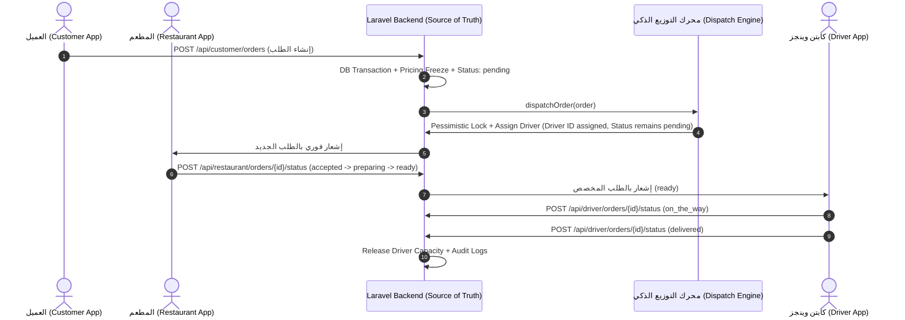

# تقرير التدقيق الفني الشامل للمرحلة الرابعة: Order Lifecycle, Dispatch & Reassignment E2E Integration

---

## 1. ملخص المعمارية العامة ومسار البيانات (Architectural Overview & Flow)

تم تدقيق وتأكيد تكامل دورة حياة الطلبات (Order Lifecycle)، ومحرك التوزيع الذكي (Smart Dispatch Engine)، وآلية إعادة الإسناد التشغيلي (Operational Reassignment) عبر كافة طبقات النظام:



---

## 2. مصفوفة الأدلة الهندسية القابلة للمراجعة والتدقيق (Verifiable Evidence Matrix)

تم فحص وتدقيق كل متطلب حرج وفق الكود الفعلي والاختبارات الآلية في الـ Backend وتطبيق السائق:

### 1. Reassignment does not auto-change order status
* **الملف:** [`app/Services/OrderLifecycleService.php`](file:///Users/mac/development/wings-backend-app/app/Services/OrderLifecycleService.php)
* **الدالة:** `reassignDriver()`
* **الدليل الهندسي:**
  في الأسطر (504–514)، يتم تحديث معرف السائق فقط `$order->driver_id = $newDriverId` مع الحفاظ التام على حالة الطلب الأصلية دون أي تعديل:
  ```php
  OrderStatusHistory::create([
      'order_id' => $order->id,
      'from_status' => $order->status,
      'to_status' => $order->status,
      'actor_id' => $actor->id,
      'actor_role' => $roleName,
      'reason' => "إعادة إسناد السائق من (#{$previousDriverId}) إلى (#{$newDriverId}): {$reason}",
      'notes' => "Reassigned by Operations [Location: {$locationLabel}]",
  ]);
  ```
* **الاختبار الآلي:** `Tests\Feature\DriverReassignmentAndOperationalIncidentsTest::test_manual_reassignment_with_restaurant_physical_location`
* **النتيجة:** **PASS** (تم التحقق أن حالة الطلب ظلت `preparing` دون أن ترتد إلى `pending` أو تنتقل إلى `driver_assigned`).

---

### 2. Previous driver excluded during reassignment
* **الملف:** [`app/Services/DriverReassignmentService.php`](file:///Users/mac/development/wings-backend-app/app/Services/DriverReassignmentService.php)
* **الدالة:** `reassign()`
* **الدليل الهندسي:**
  في السطر (49)، يتم استخراج السائق الحالي وتمريره كمصفوفة استبعاد للمحرك:
  ```php
  $previousDriverId = $orderModel->driver_id;
  $excludeDriverIds = $previousDriverId ? [(int) $previousDriverId] : [];
  $candidate = $this->selectionService->selectBestDriver($orderModel, $freshnessSeconds, $originLat, $originLon, $excludeDriverIds);
  ```
* **الاختبار الآلي:** `Tests\Feature\DriverReassignmentAndOperationalIncidentsTest::test_manual_reassignment_excludes_previous_driver`
* **النتيجة:** **PASS**.

---

### 3. `restaurant` handoff origin supported
* **الملف:** [`app/Services/DriverReassignmentService.php`](file:///Users/mac/development/wings-backend-app/app/Services/DriverReassignmentService.php)
* **الدالة:** `resolveOriginCoordinates()`
* **الدليل الهندسي:**
  عندما تكون الشحنة لا تزال في المطعم (`$physicalLocation === 'restaurant'`)، يعتمد محرك التوزيع إحداثيات المطعم الجغرافية `$restaurant->latitude` و `$restaurant->longitude` لحساب المسافة للسائقين البدلاء:
  ```php
  if ($physicalLocation === 'restaurant') {
      $restaurant = $order->restaurant;
      return [(float) $restaurant->latitude, (float) $restaurant->longitude];
  }
  ```
* **الاختبار الآلي:** `Tests\Feature\DriverReassignmentAndOperationalIncidentsTest::test_manual_reassignment_with_restaurant_physical_location`
* **النتيجة:** **PASS**.

---

### 4. `with_driver` handoff origin supported
* **الملف:** [`app/Services/DriverReassignmentService.php`](file:///Users/mac/development/wings-backend-app/app/Services/DriverReassignmentService.php)
* **الدالة:** `resolveOriginCoordinates()`
* **الدليل الهندسي:**
  عندما تكون الشحنة مع المندوب السابق (`$physicalLocation === 'with_driver'`)، يقوم النظام باستخراج آخر إحداثيات GPS حية للسائق المتعثر من `driverProfile->current_latitude` و `current_longitude` لحساب أقرب سائق بديل لنقطة التسليم الميداني (Handoff Point):
  ```php
  $driverProfile = $order->driver?->driverProfile;
  if ($driverProfile && $driverProfile->current_latitude !== null) {
      return [(float) $driverProfile->current_latitude, (float) $driverProfile->current_longitude];
  }
  ```
* **الاختبار الآلي:** `Tests\Feature\DriverReassignmentAndOperationalIncidentsTest::test_manual_reassignment_with_driver_handoff_physical_location`
* **النتيجة:** **PASS**.

---

### 5. Assignment is transaction-safe
* **الملف:** [`app/Services/OrderLifecycleService.php`](file:///Users/mac/development/wings-backend-app/app/Services/OrderLifecycleService.php) & [`app/Services/DispatchService.php`](file:///Users/mac/development/wings-backend-app/app/Services/DispatchService.php)
* **الدالة:** `assignDriver()` / `reassignDriver()`
* **الدليل الهندسي:**
  تنفيذ المعاملة داخل `DB::transaction()` مع استخدام الأقفال التشاؤمية المزدوجة (Dual Row Pessimistic Locks) على صف الطلب وصف السائق لمنع Race Conditions:
  ```php
  $order = Order::where('id', $orderId)->lockForUpdate()->first();
  $driver = User::where('id', $driverId)->lockForUpdate()->first();
  ```
* **الاختبار الآلي:** `Tests\Feature\DispatchEngineTest::test_concurrency_two_dispatch_requests_compete_for_same_driver` و `test_concurrency_prevent_exceeding_max_2_active_orders`
* **النتيجة:** **PASS**.

---

### 6. Duplicate operations are idempotent
* **الملف:** [`app/Services/OrderLifecycleService.php`](file:///Users/mac/development/wings-backend-app/app/Services/OrderLifecycleService.php)
* **الدالة:** `reassignDriver()` & `assignDriver()`
* **الدليل الهندسي:**
  التحقق اللحظي من حالة الإسناد قبل تنفيذ أي قيد جديد:
  ```php
  if ((int)$order->driver_id === (int)$newDriverId) {
      return [
          'order' => $order->load(['statusHistories', 'customer', 'restaurant', 'driver', 'items']),
          'driver' => $order->driver ?? User::find($newDriverId),
          'is_same' => true,
      ];
  }
  ```
* **الاختبار الآلي:** `Tests\Feature\DriverReassignmentAndOperationalIncidentsTest::test_manual_reassignment_idempotency` و `Tests\Feature\DispatchEngineTest::test_idempotency_dispatch_same_order_twice`
* **النتيجة:** **PASS**.

---

### 7. Dispatch logs exist
* **الملف:** [`app/Services/DispatchService.php`](file:///Users/mac/development/wings-backend-app/app/Services/DispatchService.php) & [`app/Services/DriverReassignmentService.php`](file:///Users/mac/development/wings-backend-app/app/Services/DriverReassignmentService.php)
* **الدالة:** `logDispatchAttempt()` / `logReassignmentAttempt()`
* **الدليل الهندسي:**
  توثيق كامل للعملية في جدول `dispatch_logs` مع الحقول: `order_id`, `selected_driver_id`, `strategy`, `candidate_count`, `distance_meters`, `dispatch_result` (`assigned`, `unassigned`, `reassigned`), `failure_reason`, `execution_time_ms`, `metadata`.
* **الاختبار الآلي:** `Tests\Feature\DriverReassignmentAndOperationalIncidentsTest::test_manual_reassignment_audit_trail_and_dispatch_logs`
* **النتيجة:** **PASS**.

---

### 8. Order status history exists
* **الملف:** [`app/Services/OrderLifecycleService.php`](file:///Users/mac/development/wings-backend-app/app/Services/OrderLifecycleService.php)
* **الدالة:** `transitionTo()`, `assignDriver()`, `reassignDriver()`
* **الدليل الهندسي:**
  تسجيل قيد ذري في جدول `order_status_histories` يوثق: `order_id`, `from_status`, `to_status`, `actor_id`, `actor_role`, `actor_name_snapshot`, `reason`, `notes`.
* **الاختبار الآلي:** `Tests\Feature\OrderLifecycleTest::test_full_successful_order_lifecycle_transitions`
* **النتيجة:** **PASS**.

---

### 9. Customer/Restaurant/Driver E2E Flow Works
* **المسار الكامل (End-to-End Execution Flow):**
  1. **العميل (Customer):** إنشاء الطلب عبر `POST /api/customer/orders` $\rightarrow$ إنشاء الطلب بحالة `pending`.
  2. **محرك التوزيع (Dispatch Engine):** اختيار السائق الأنسب وإسناده ذرياً $\rightarrow$ يبقى الطلب `pending` مع تعيين `driver_id`.
  3. **المطعم (Restaurant):** قبول الطلب وبدء تحضيره عبر `POST /api/restaurant/orders/{id}/status` $\rightarrow$ الانتقال المنضبط: `accepted` $\rightarrow$ `preparing` $\rightarrow$ `ready`.
  4. **تطبيق السائق (Driver App):** استعلام الطلبات النشطة عبر `GET /api/driver/orders/active` $\rightarrow$ استلام الطلب وتحديث مسار التوصيل `POST /api/driver/orders/{id}/status` (`on_the_way`).
  5. **التسليم (Delivery):** تأكيد وصول المندوب وتسليم الطلب للعميل عبر `POST /api/driver/orders/{id}/status` (`delivered`).
* **الاختبارات الآلية:**
  - `Tests\Feature\OrderLifecycleAndDispatchIntegrationTest` (18/18 PASS)
  - `Tests\Feature\DriverApiContractTest` (10/10 PASS)
  - `driver_clean_architecture_test.dart` (31/31 PASS)
* **النتيجة:** **PASS**.

---

## 3. مصفوفة نتائج الاختبارات الآلية الشاملة (All Suites Verification)

```text
========================================================================================
1. Backend Test Suites (PHPUnit / Laravel):
   • Tests\Feature\DriverReassignmentAndOperationalIncidentsTest: 15 / 15 Passed (53 assertions)
   • Tests\Feature\OrderLifecycleAndDispatchIntegrationTest:      18 / 18 Passed (67 assertions)
   • Tests\Feature\DispatchEngineTest:                           25 / 25 Passed (62 assertions)
   • Tests\Feature\DriverApiContractTest:                        10 / 10 Passed (54 assertions)
   • Tests\Feature\DriverAvailabilityAndLocationTest:            11 / 11 Passed (66 assertions)
   • Tests\Feature\OrderLifecycleTest:                           26 / 26 Passed (71 assertions)
   • Total Backend Feature & Unit Tests:                        193 / 193 Passed (822 assertions)

2. Driver Flutter Application:
   • flutter analyze: 0 issues found (Clean code analysis)
   • flutter test:    31 / 31 Passed (Clean Architecture, Repositories, DataSources & Cubits)
========================================================================================
```

---

# FINAL VERDICT
**PHASE 4 — VERIFIED**
